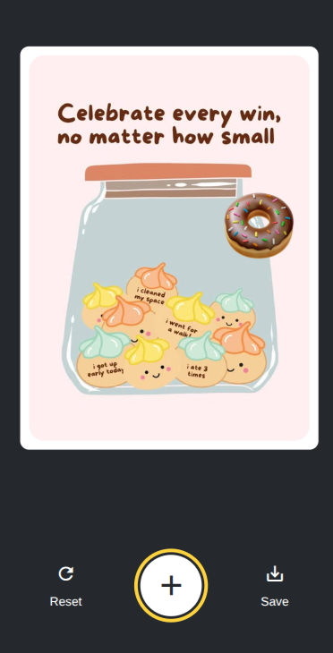

# StickerSmash

A fun app that lets you add emoji stickers to your photos and save the result. Built with React Native and Expo, it runs on Android, iOS, and the web with a single codebase.



## What This App Does

- Pick a photo from your device or use a default image
- Add emoji stickers to your photos
- Move stickers around with touch gestures
- Save your creation to your device or download it (on web)

## Getting Started

1. **Install dependencies**

   ```bash
   npm install
   ```

2. **Start the app**

   ```bash
   npx expo start
   ```

   You'll see options to open the app in:
   - Android emulator
   - iOS simulator
   - Web browser
   - Expo Go app (on your phone)

## How It Works

This app was built following the [Expo tutorial](https://docs.expo.dev/tutorial/introduction/). It demonstrates:

- Creating screens with Expo Router
- Using image pickers to select photos
- Building modals and interactive components
- Adding touch gestures for moving stickers
- Taking screenshots and saving them
- Handling differences between Android, iOS, and web platforms

## Project Structure

- `app/` - Main app screens and routing
- `components/` - Reusable UI components (buttons, image viewer, emoji picker, etc.)
- `assets/` - Images and other static assets

## Learn More

- [Expo Documentation](https://docs.expo.dev/) - Learn the fundamentals
- [Expo Tutorial](https://docs.expo.dev/tutorial/introduction/) - Step-by-step guide to building this app
- [Expo Router](https://docs.expo.dev/router/introduction/) - File-based routing for React Native

## Built With

- [React Native](https://reactnative.dev/)
- [Expo](https://expo.dev/)
- [Expo Router](https://docs.expo.dev/router/introduction/)
- TypeScript
